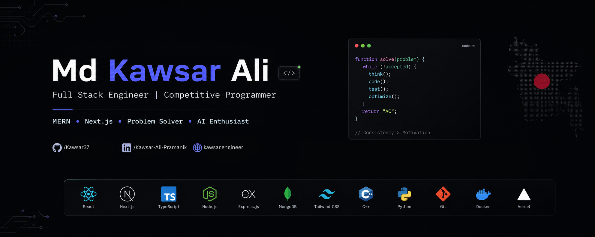

<!-- 🔥 Banner Image -->

  

<!-- 👋 Name & Designation -->
<h1 align="center">Hi 👋, I'm Md. Kawsar Ali</h1>
<h3 align="center">🚀 Software Engineer | Competitive Programmer | Full Stack Developer</h3>

<!-- 👀 Profile Views -->

  

<!-- ✨ Animated Typing -->

  

---

## 🧑‍💻 About Me

I am a Computer Science graduate with a strong background in competitive programming and full-stack web development. I enjoy solving complex problems and building efficient, scalable, and modern applications.

---

## 🔥 Current Activities

- 🚀 Exploring **Next.js & Advanced React**
- 💻 Working on **modern web applications**
- 🧠 Practicing **DSA & problem solving**
- ⚙️ Learning **DevOps & system design**
- 📱 Building **real-world full stack projects**

---

## 🛠️ Skills & Tools

  

---

## 🌐 Connect With Me

  
  
  
  
  

---

## 📊 GitHub Stats

  

  
  
  

---

## 🏆 Achievements & Milestones

  
  
  

  
  
  

---

## 📫 Get In Touch

  <strong>💼 Let's collaborate and build something extraordinary together!</strong>

### 📧 Email

### 🔗 Quick Links

|                                                                                                                                                            |                                                                                                                                                           |                                                                                                                                               |
| ---------------------------------------------------------------------------------------------------------------------------------------------------------- | --------------------------------------------------------------------------------------------------------------------------------------------------------- | --------------------------------------------------------------------------------------------------------------------------------------------- |
|  |                       |  |
|               |  |       |

---

### 📍 Location & Availability

🌍 **Bangladesh** | ⏰ **Available for freelance work & collaborations**

### 💬 Preferred Contact Method

> 📧 Email is the best way to reach me for professional inquiries. I typically respond within 24 hours.

---

  <em><b>✨ Let's create something incredible together! ✨</b></em>

---

  <strong>Made with ❤️ by Md. Kawsar Ali</strong>
   
  © 2024 - 2026 | All Rights Reserved

